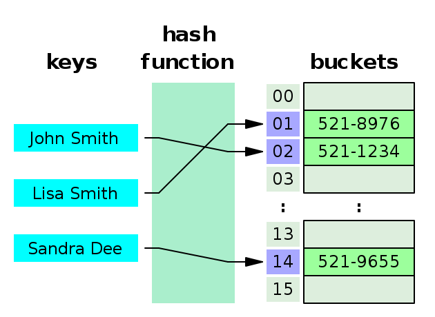

# Hash Tables

---
## Many Names

Hash Tables are known by many different names! Let's treat these all as
synonyms.

* Hash Tables
* Hash Maps
* Maps
* Dictionaries
* Objects (JavaScript)
* Hashes (Ruby)

---
## Valet Parking Analogy
* Imagine running a valet parking lot.
* Your job is to park cars when people arrive
* And to retrieve cars when people return

Let's consider different strategies for running an efficient valet lot.

---
## Strategy: Park In Order

### Parking Strategy
* Put the car in the first empty spot.
* The first car goes in spot 1
* The second car goes in spot 2
* The third car goes in spot 3
* If cars exit and leave gaps fill them as you park new cars

### Retrieval Strategy
* Search from spot 1 until you find the car to return

---
## Operations

Hash Tables store key/value pairs. Here's the common operations/methods
they have:

* **O(1)** `get(key)`
* **O(1)** `put(key, value)`
* **O(1)** `delete(key)`

They also should have other useful utility methods:

* `size()`
* `keys()`
* `values()`

